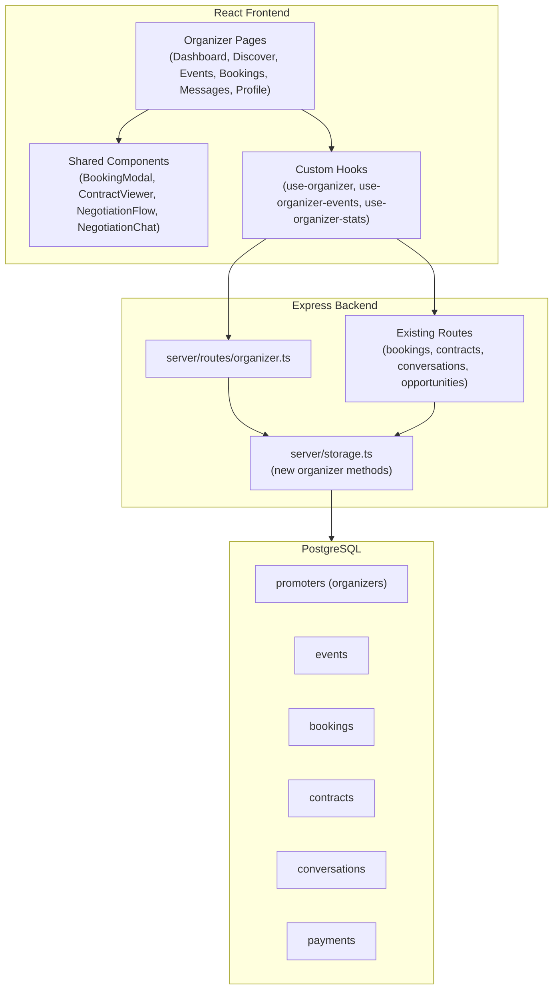
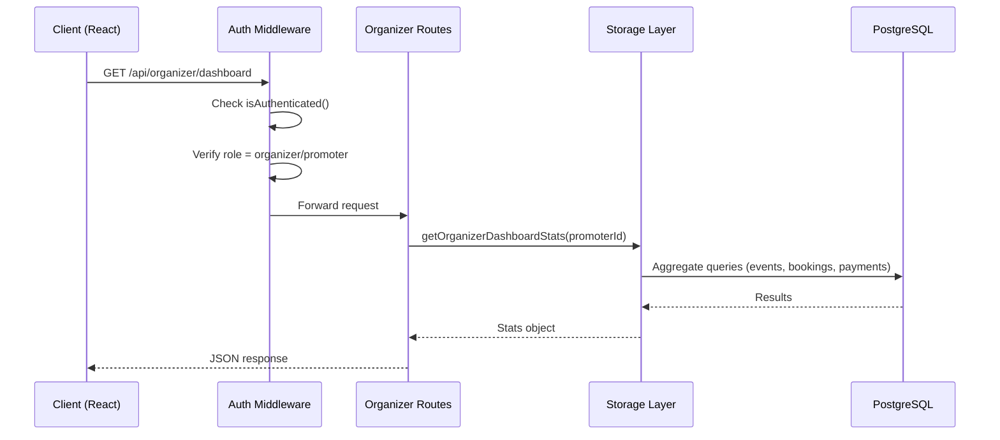
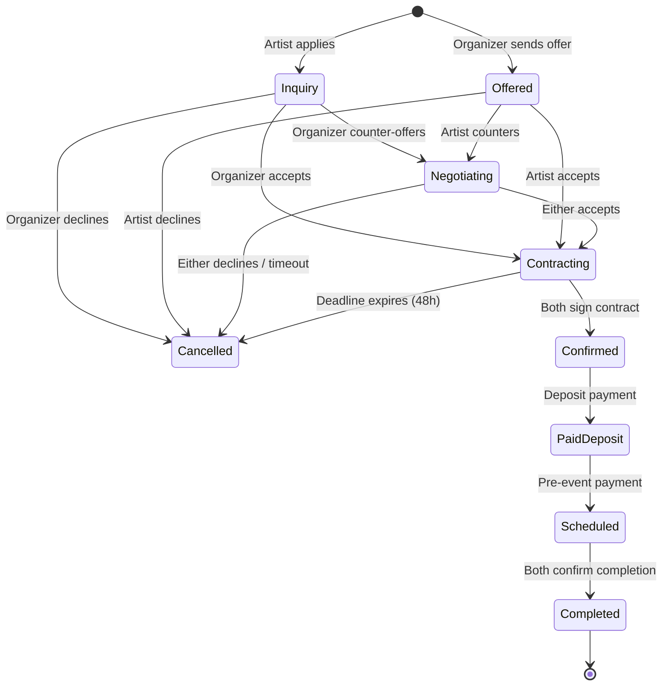

# Design Document: Organizer Role

## Overview

This design implements the complete Organizer/Promoter role workflow for the BANDWIDTH music booking platform. The Organizer is the demand-side actor who creates events, discovers and books artists, negotiates terms, manages contracts, and handles payments. This feature builds dedicated pages, API endpoints, storage methods, and navigation on top of the existing `promoters` table (aliased as `organizers`), booking/negotiation/contract flows, and conversation infrastructure.

The implementation follows the existing codebase patterns: Drizzle ORM for data access, Zod for validation, TanStack Query hooks for client state, shadcn/ui components, and Wouter routing. No new database tables are needed — all Organizer data fits into existing tables using JSONB `metadata` and `contact_person` columns on the `promoters` table.

### Key Design Decisions

1. **No new tables**: The `promoters` table already stores organizer profiles. Extended fields (website, social links, trust score) go into `metadata` JSONB. Contact details go into `contact_person` JSONB.
2. **Reuse existing infrastructure**: Booking, contract, negotiation, conversation, and payment tables/APIs are already built. The Organizer role adds role-specific views and a few new endpoints on top.
3. **Route module pattern**: A new `server/routes/organizer.ts` module handles all organizer-specific API endpoints, mounted in `server/routes.ts`.
4. **Page organization**: New pages live under `client/src/pages/organizer/`, following the existing `artist/` and `venue/` pattern.
5. **Profile completeness via metadata**: `metadata.profileComplete` flag on the `promoters` table drives onboarding redirect logic, matching the artist/venue pattern.

## Architecture

### System Context



### Request Flow



### Booking Lifecycle (Organizer Perspective)



## Components and Interfaces

### New Server Route Module: `server/routes/organizer.ts`

All endpoints require authentication and organizer/promoter role verification.

| Method | Path | Description | Request | Response |
|--------|------|-------------|---------|----------|
| GET | `/api/organizer/profile` | Get current organizer profile | — | `Promoter & { user: User }` |
| PUT | `/api/organizer/profile` | Update organizer profile | `Partial<UpdateOrganizerInput>` | `Promoter` |
| POST | `/api/organizer/profile/complete` | Complete onboarding wizard | `OrganizerOnboardingInput` | `{ message, organizer }` |
| GET | `/api/organizer/profile/status` | Check profile completion | — | `{ isComplete: boolean }` |
| GET | `/api/organizer/dashboard` | Dashboard stats | — | `OrganizerDashboardStats` |
| GET | `/api/organizer/events` | List organizer's events | `?status=draft\|published\|completed\|cancelled` | `Event[]` |
| POST | `/api/organizer/events` | Create event | `CreateEventInput` | `Event` |
| PUT | `/api/organizer/events/:id` | Update event | `Partial<CreateEventInput>` | `Event` |
| DELETE | `/api/organizer/events/:id` | Delete event (if no active bookings) | — | `{ message }` |
| PUT | `/api/organizer/events/:id/publish` | Publish event | — | `Event` |
| GET | `/api/organizer/bookings` | List organizer's bookings | `?status=...` | `BookingWithDetails[]` |
| GET | `/api/organizer/bookings/:id` | Get booking detail | — | `BookingWithDetails` |
| GET | `/api/organizer/activity` | Recent activity feed | `?limit=10` | `AuditLog[]` |
| POST | `/api/organizer/bookings/:id/complete` | Confirm event completion | `{ rating, note }` | `Booking` |

### New Storage Methods in `server/storage.ts`

```typescript
// Added to IStorage interface and DatabaseStorage class:

// Dashboard
getOrganizerDashboardStats(promoterId: number): Promise<OrganizerDashboardStats>;

// Events
getEventsByOrganizer(organizerId: number, status?: string): Promise<Event[]>;
getEventWithBookingCount(eventId: number): Promise<Event & { bookingCount: number }>;
deleteEvent(eventId: number): Promise<void>;
hasActiveBookings(eventId: number): Promise<boolean>;

// Profile
updateOrganizer(id: number, data: Partial<InsertOrganizer>): Promise<Organizer>;

// Bookings
getOrganizerBookingSummary(organizerId: number): Promise<BookingSummary>;

// Activity
getRecentActivity(userId: number, limit?: number): Promise<AuditLog[]>;

// Payments
getPaymentsByBooking(bookingId: number): Promise<Payment[]>;
getOrganizerPaymentTotal(organizerId: number): Promise<number>;
```

### New Route Contracts in `shared/routes.ts`

```typescript
// Added to the api object:
organizer: {
  profile: {
    get: { method: 'GET', path: '/api/organizer/profile', ... },
    update: { method: 'PUT', path: '/api/organizer/profile', ... },
    complete: { method: 'POST', path: '/api/organizer/profile/complete', ... },
    status: { method: 'GET', path: '/api/organizer/profile/status', ... },
  },
  dashboard: { method: 'GET', path: '/api/organizer/dashboard', ... },
  events: {
    list: { method: 'GET', path: '/api/organizer/events', ... },
    create: { method: 'POST', path: '/api/organizer/events', ... },
    update: { method: 'PUT', path: '/api/organizer/events/:id', ... },
    delete: { method: 'DELETE', path: '/api/organizer/events/:id', ... },
    publish: { method: 'PUT', path: '/api/organizer/events/:id/publish', ... },
  },
  bookings: {
    list: { method: 'GET', path: '/api/organizer/bookings', ... },
    get: { method: 'GET', path: '/api/organizer/bookings/:id', ... },
    complete: { method: 'POST', path: '/api/organizer/bookings/:id/complete', ... },
  },
  activity: { method: 'GET', path: '/api/organizer/activity', ... },
}
```

### New React Pages: `client/src/pages/organizer/`

| File | Route | Description |
|------|-------|-------------|
| `OrganizerDashboard.tsx` | `/dashboard` (role-based) | Stats cards, upcoming events, pending actions, activity feed |
| `OrganizerDiscover.tsx` | `/organizer/discover` | Tabbed artist/venue discovery with filters |
| `OrganizerEvents.tsx` | `/organizer/events` | Event list grouped by status |
| `OrganizerEventCreate.tsx` | `/organizer/events/create` | Event creation form with stages |
| `OrganizerBookings.tsx` | `/bookings` (role-based) | Booking list grouped by status |
| `OrganizerMessages.tsx` | `/organizer/messages` | Conversation list and chat view |
| `OrganizerProfile.tsx` | `/profile` (role-based) | Profile view/edit with trust score and booking history |
| `OrganizerSetup.tsx` | `/organizer/setup` | Onboarding wizard (multi-step form) |

### New React Hooks: `client/src/hooks/`

| Hook | Purpose |
|------|---------|
| `use-organizer.ts` | Fetch/update organizer profile, profile status check |
| `use-organizer-events.ts` | CRUD operations for organizer events |
| `use-organizer-stats.ts` | Dashboard stats and activity feed |

### Shared Component Reuse

These existing components are reused directly by Organizer pages:

| Component | Used In | Notes |
|-----------|---------|-------|
| `BookingModal` | OrganizerDiscover | Send booking offer from artist card |
| `ContractViewer` | OrganizerBookings (detail) | View/sign contracts |
| `NegotiationFlow` | OrganizerBookings (detail) | Structured negotiation UI |
| `NegotiationChat` | OrganizerBookings (detail) | Conversation-based negotiation |
| `OfferComparison` | OrganizerBookings (detail) | Side-by-side offer comparison |
| `CounterOfferForm` | OrganizerBookings (detail) | Submit counter-offers |
| `DynamicActionPanel` | OrganizerBookings (detail) | Context-sensitive action buttons |

### Navigation Updates

The `Sidebar` component in `Navigation.tsx` needs organizer-specific nav items:

```typescript
// When role === "organizer" || role === "promoter":
const navItems = [
  { label: "Dashboard", href: "/dashboard", icon: LayoutDashboard },
  { label: "Discover", href: "/organizer/discover", icon: Search },
  { label: "Events", href: "/organizer/events", icon: CalendarDays },
  { label: "Bookings", href: "/bookings", icon: Calendar },
  { label: "Messages", href: "/organizer/messages", icon: MessageSquare },
  { label: "Profile", href: "/profile", icon: Users },
];
```

### Routing Updates in `App.tsx`

New routes added:

```typescript
// Organizer-specific routes
<Route path="/organizer/setup"><OrganizerSetup /></Route>
<Route path="/organizer/discover"><PrivateRoute component={OrganizerDiscover} /></Route>
<Route path="/organizer/events"><PrivateRoute component={OrganizerEvents} /></Route>
<Route path="/organizer/events/create"><PrivateRoute component={OrganizerEventCreate} /></Route>
<Route path="/organizer/messages"><PrivateRoute component={OrganizerMessages} /></Route>

// Role-based components updated:
// RoleBasedDashboard: "organizer" | "promoter" → OrganizerDashboard
// RoleBasedBookings: "organizer" | "promoter" → OrganizerBookings
// RoleBasedProfile: "organizer" | "promoter" → OrganizerProfile
```

Profile completion redirect added to `PrivateRoute`:
```typescript
if ((user.role === "organizer" || user.role === "promoter") && 
    organizerStatus && !organizerStatus.isComplete && 
    !location.startsWith("/organizer/setup")) {
  return <Redirect to="/organizer/setup" />;
}
```

## Data Models

### Existing Tables Used (No Schema Changes)

#### `promoters` table (aliased as `organizers`)
| Column | Type | Usage |
|--------|------|-------|
| `id` | serial PK | Organizer ID |
| `userId` | FK → users | Links to auth user |
| `organizationId` | FK → organizations | Optional org link |
| `name` | text | Organization/promoter name |
| `description` | text | About the organization |
| `contactPerson` | jsonb | `{ name, email, phone }` |
| `metadata` | jsonb | Extended fields (see below) |
| `createdAt` | timestamp | Account creation |
| `updatedAt` | timestamp | Last update |

#### `metadata` JSONB structure for organizers
```typescript
interface OrganizerMetadata {
  profileComplete: boolean;       // Onboarding completion flag
  trustScore: number;             // 0-100, initialized to 50
  website?: string;               // Organization website
  socialLinks?: {                 // Social media
    instagram?: string;
    twitter?: string;
    linkedin?: string;
  };
  pastEventReferences?: string[]; // URLs or descriptions of past events
  bookingEmail?: string;          // Preferred booking contact email
  bookingPhone?: string;          // Preferred booking contact phone
}
```

#### `events` table
Used as-is. `organizer_id` FK points to `promoters.id`. Status field values: `draft`, `published`, `completed`, `cancelled`.

#### `bookings` table
Used as-is. Linked to events via `event_id`. The `meta` JSONB stores negotiation history, slot time, and completion feedback:
```typescript
interface BookingMeta {
  negotiationRound: number;
  history: Array<{
    action: string;
    by: string;
    at: string;
    amount?: number;
    message?: string;
  }>;
  slotTime?: string;           // "opening" | "mid" | "closing"
  completionFeedback?: {
    confirmedBy: string;       // "organizer" | "artist"
    rating: number;            // 1-5
    note?: string;
    confirmedAt: string;
  };
}
```

#### `contracts` table
Used as-is. Auto-generated when booking transitions to "contracting". 48-hour signing deadline enforced via `deadline_at`.

#### `payments` table
Used as-is. Deposit payment created when contract is fully signed. `payer_id` = organizer's user ID, `payee_id` = artist's user ID.

#### `conversations` / `messages` tables
Used as-is. Conversations auto-created when bookings are created, linked via `entity_type = "booking"`.

#### `audit_logs` table
Used as-is. Activity feed queries filter by `who = user.id` with recent entries.

### Zod Validation Schemas

```typescript
// Onboarding input
const organizerOnboardingSchema = z.object({
  organizationName: z.string().min(2).max(200),
  description: z.string().min(10).max(2000),
  contactPerson: z.object({
    name: z.string().min(2),
    email: z.string().email(),
    phone: z.string().min(10),
  }),
  website: z.string().url().optional(),
  pastEventReferences: z.array(z.string()).min(1).optional(),
});

// Profile update input
const organizerProfileUpdateSchema = z.object({
  name: z.string().min(2).max(200).optional(),
  description: z.string().max(2000).optional(),
  contactPerson: z.object({
    name: z.string().min(2),
    email: z.string().email(),
    phone: z.string().min(10),
  }).optional(),
  website: z.string().url().optional(),
  socialLinks: z.object({
    instagram: z.string().optional(),
    twitter: z.string().optional(),
    linkedin: z.string().optional(),
  }).optional(),
});

// Event creation input
const createEventSchema = z.object({
  title: z.string().min(3).max(200),
  description: z.string().optional(),
  startTime: z.string().datetime(),
  endTime: z.string().datetime().optional(),
  doorTime: z.string().datetime().optional(),
  venueId: z.number().optional(),
  capacityTotal: z.number().int().positive().optional(),
  currency: z.string().length(3).default("INR"),
  visibility: z.enum(["public", "private"]).default("private"),
  stages: z.array(z.object({
    name: z.string(),
    startTime: z.string().datetime().optional(),
    endTime: z.string().datetime().optional(),
    capacity: z.number().int().positive().optional(),
  })).optional(),
});

// Completion confirmation input
const completionConfirmSchema = z.object({
  confirmed: z.boolean(),
  rating: z.number().int().min(1).max(5),
  note: z.string().max(1000).optional(),
});
```

### Dashboard Stats Response Shape

```typescript
interface OrganizerDashboardStats {
  totalEvents: number;
  upcomingEvents: number;
  activeBookings: number;
  pendingNegotiations: number;
  totalSpent: number;          // Sum of completed payment amounts
  trustScore: number;          // From metadata
}
```

### Booking Summary Response Shape

```typescript
interface BookingSummary {
  totalBookings: number;
  completedBookings: number;
  cancellationRate: number;    // percentage
  averageBookingValue: number; // average finalAmount
}
```


## Correctness Properties

*A property is a characteristic or behavior that should hold true across all valid executions of a system — essentially, a formal statement about what the system should do. Properties serve as the bridge between human-readable specifications and machine-verifiable correctness guarantees.*

### Property 1: Registration creates linked records

*For any* valid registration input with role "organizer" or "promoter", the system should create both a user record with `metadata.role` set to the selected role and a corresponding promoter record where `promoter.userId` equals the created user's ID.

**Validates: Requirements 1.1**

### Property 2: Incomplete profile triggers redirect

*For any* organizer user where `metadata.profileComplete` is not `true`, the routing logic should redirect to `/organizer/setup` when accessing any protected organizer route (unless the route is `/organizer/setup` itself or the user has explicitly skipped onboarding).

**Validates: Requirements 1.2**

### Property 3: Onboarding validation rejects incomplete input

*For any* onboarding input missing a required field (organization name, description, or contact person with name/email/phone), the onboarding schema validation should reject the input. For any input with all required fields present and valid, the schema should accept it.

**Validates: Requirements 1.3**

### Property 4: Onboarding round-trip

*For any* valid onboarding input, after submitting the onboarding wizard and then reading the organizer profile back, the stored `name`, `description`, and `contactPerson` fields should match the submitted values, and `metadata.profileComplete` should be `true`.

**Validates: Requirements 1.4**

### Property 5: Trust score initialization

*For any* organizer completing onboarding, the resulting `metadata.trustScore` should be exactly 50.

**Validates: Requirements 1.5**

### Property 6: Dashboard stats accuracy

*For any* organizer with a set of events and bookings, the dashboard stats should satisfy: `totalEvents` equals the count of events where `organizer_id` matches, `upcomingEvents` equals the count of those events with `start_time` in the future, `activeBookings` equals the count of bookings in non-terminal statuses (not cancelled/completed/refunded), and `pendingNegotiations` equals the count of bookings with status "negotiating".

**Validates: Requirements 2.1**

### Property 7: Upcoming events sorted ascending

*For any* list of upcoming events returned by the dashboard, for every consecutive pair of events (e[i], e[i+1]), `e[i].startTime <= e[i+1].startTime`.

**Validates: Requirements 2.2**

### Property 8: Pending actions completeness

*For any* organizer, the pending actions list should include every booking where: the contract exists but is unsigned by the organizer, or the booking status is "negotiating" and the last history entry's `by` field is not the organizer's role, or the booking is "completed" but the organizer has not confirmed completion, or a payment is overdue.

**Validates: Requirements 2.3**

### Property 9: Activity feed ordering and limit

*For any* organizer's activity feed request with limit N, the returned list should contain at most N entries, and for every consecutive pair (a[i], a[i+1]), `a[i].occurredAt >= a[i+1].occurredAt` (newest first).

**Validates: Requirements 2.5**

### Property 10: Artist filter conjunction

*For any* set of artists and any combination of active filters (genre, budget range, location, minimum trust score), every artist in the returned results must satisfy ALL active filter criteria simultaneously. No artist satisfying all criteria should be excluded.

**Validates: Requirements 3.2, 3.3**

### Property 11: Artist sort ordering

*For any* sort option (price-low-to-high, price-high-to-low, rating, trust-score) applied to artist discovery results, for every consecutive pair of artists (a[i], a[i+1]), the sort key of a[i] should be ≤ (or ≥, depending on direction) the sort key of a[i+1].

**Validates: Requirements 3.6**

### Property 12: Venue filter conjunction

*For any* set of venues and any combination of active filters (capacity range, city, amenities), every venue in the returned results must satisfy ALL active filter criteria. No venue satisfying all criteria should be excluded.

**Validates: Requirements 4.2**

### Property 13: Event creation sets correct organizer and status

*For any* valid event creation input submitted by an organizer, the created event record should have `organizer_id` equal to the organizer's promoter ID, `status` equal to "draft", and `events.organizer_id` should reference the `promoters` table via the existing FK.

**Validates: Requirements 5.3, 14.2**

### Property 14: Event creation persists stages

*For any* valid event creation input that includes a stages array, after creation, querying event stages for that event should return exactly the same number of stages with matching names and times.

**Validates: Requirements 5.2**

### Property 15: Events list contains only organizer's events

*For any* organizer, the events list endpoint should return exactly the events where `organizer_id` matches the organizer's promoter ID, and no events belonging to other organizers.

**Validates: Requirements 5.4**

### Property 16: Publishing changes status to published

*For any* event in "draft" status, publishing it should change the status to "published". For any event not in "draft" status, publishing should fail.

**Validates: Requirements 5.5**

### Property 17: Event edit restrictions with confirmed bookings

*For any* event in "draft" or "published" status with no confirmed bookings, edits to any field should succeed. For any event with at least one confirmed booking, edits to `startTime` or `venueId` should be rejected while edits to other fields (title, description, capacity) should succeed.

**Validates: Requirements 5.6**

### Property 18: Event deletion blocked by active bookings

*For any* event with at least one booking in a non-terminal status (not cancelled, completed, or refunded), deletion should fail with an error listing the active bookings. For any event with zero active bookings, deletion should succeed.

**Validates: Requirements 5.7**

### Property 19: Booking offer creates correct record

*For any* valid booking offer input (artist, event, amount, slot time), the created booking should have `status` = "offered", `artistId` and `eventId` matching the input, `offerAmount` matching the input, and `meta.history` containing exactly one entry with `action` = "offered".

**Validates: Requirements 6.2**

### Property 20: Duplicate booking prevention

*For any* artist-event pair that already has a booking in a non-cancelled status, attempting to create another booking for the same pair should fail with a conflict error.

**Validates: Requirements 6.3**

### Property 21: Bookings grouped by status

*For any* set of bookings returned by the organizer bookings list, grouping them by status should produce disjoint groups where every booking appears in exactly one group matching its actual status.

**Validates: Requirements 6.6**

### Property 22: Acceptance transitions to contracting

*For any* booking in "offered", "inquiry", or "negotiating" status, when either party accepts, the booking status should transition to "contracting" and `finalAmount` should equal the last `offerAmount`.

**Validates: Requirements 6.7, 7.6**

### Property 23: Counter-offer increments negotiation round

*For any* booking in "offered" or "negotiating" status with `negotiationRound < 3`, sending a counter-offer should increment `meta.negotiationRound` by 1, append a new entry to `meta.history` with the counter-offer details, and set status to "negotiating".

**Validates: Requirements 7.1**

### Property 24: Max negotiation rounds enforced

*For any* booking where `meta.negotiationRound >= 3`, attempting to send a counter-offer should fail with an error. Only accept or decline actions should be permitted.

**Validates: Requirements 7.2**

### Property 25: Contract auto-generation on contracting

*For any* booking that transitions to "contracting" status, a contract record should be created with `status` = "draft", `bookingId` matching the booking, and non-empty `contractText` containing the agreed amount and event details.

**Validates: Requirements 8.1**

### Property 26: Contract signing deadline

*For any* contract, `deadlineAt` should be within 48 hours (± 1 minute tolerance) of `initiatedAt`. For any contract where the current time exceeds `deadlineAt` and the contract is not fully signed, the contract status should be "voided".

**Validates: Requirements 8.3**

### Property 27: Signature recording

*For any* contract signing action by an organizer, a `contract_signatures` record should be created with the organizer's `userId`, `role` = "promoter", non-null `signedAt`, and the contract's `promoterSignedAt` should be set.

**Validates: Requirements 8.4**

### Property 28: Dual signature completes contract

*For any* contract where both `artistSignedAt` and `promoterSignedAt` are non-null, the contract `status` should be "signed" and the associated booking `status` should be "confirmed".

**Validates: Requirements 8.5**

### Property 29: One edit request per party

*For any* contract and party (artist or promoter), if an edit request already exists from that party, submitting another edit request should fail. If no edit request exists from that party, it should succeed.

**Validates: Requirements 8.6**

### Property 30: Conversation auto-creation on booking

*For any* newly created booking, a conversation should exist with `entityType` = "booking", `entityId` = the booking ID, and participants including both the organizer's userId and the artist's userId.

**Validates: Requirements 9.1**

### Property 31: Conversations sorted by last message

*For any* list of conversations returned for an organizer, for every consecutive pair (c[i], c[i+1]), `c[i].lastMessageAt >= c[i+1].lastMessageAt`.

**Validates: Requirements 9.2**

### Property 32: Message creation updates conversation timestamp

*For any* message sent in a conversation, after sending, the conversation's `lastMessageAt` should be ≥ the message's `createdAt`, and the message record should have `senderId` equal to the sender's user ID.

**Validates: Requirements 9.4**

### Property 33: Profile update round-trip

*For any* valid profile update input, after saving and then reading the organizer profile back, the updated fields should match the input values and `updatedAt` should be ≥ the time of the update request.

**Validates: Requirements 10.3**

### Property 34: Booking summary accuracy

*For any* organizer, the booking summary should satisfy: `totalBookings` equals the count of all bookings for the organizer's events, `completedBookings` equals the count with status "completed", `cancellationRate` equals `cancelled / total * 100`, and `averageBookingValue` equals the mean of `finalAmount` across completed bookings.

**Validates: Requirements 10.5**

### Property 35: Deposit payment on contract signing

*For any* fully signed contract, a payment record should exist with `bookingId` matching the contract's booking, `amount` equal to `depositPercent / 100 * finalAmount` (within rounding tolerance), `payerId` equal to the organizer's user ID, and `status` = "initiated".

**Validates: Requirements 11.1**

### Property 36: Commission calculation

*For any* booking payment, the platform commission should be between 2% and 5% (inclusive) of the booking amount.

**Validates: Requirements 11.4**

### Property 37: Completion confirmation records feedback

*For any* valid completion confirmation (confirmed=true, rating 1-5), the booking's `meta.completionFeedback` should contain the rating, optional note, and confirmer identity. If both parties have confirmed, the booking status should be "completed".

**Validates: Requirements 12.2, 12.3**

### Property 38: Both-party completion triggers payment and trust update

*For any* booking where both the organizer and artist have confirmed completion, a final payment milestone should be created and both parties' trust scores should be updated (increased for successful completion).

**Validates: Requirements 12.5**

### Property 39: Unauthenticated access redirects to auth

*For any* organizer API endpoint, a request without a valid session should receive a 401 status code. On the client side, unauthenticated access to any organizer route should redirect to `/auth`.

**Validates: Requirements 13.5**

## Error Handling

### API Error Responses

All organizer API endpoints follow the existing error schema pattern from `shared/routes.ts`:

| Status | Schema | When |
|--------|--------|------|
| 400 | `{ message, field? }` | Validation failure (Zod), invalid state transition |
| 401 | `{ message }` | Not authenticated |
| 403 | `{ message }` | Authenticated but wrong role, not authorized for resource |
| 404 | `{ message }` | Entity not found (event, booking, contract) |
| 409 | `{ message, bookingId? }` | Duplicate booking for same artist+event |
| 500 | `{ message }` | Unexpected server error |

### Specific Error Scenarios

1. **Event deletion with active bookings**: Returns 409 with list of active booking IDs that must be resolved first.
2. **Negotiation round exceeded**: Returns 400 with message "Max negotiation rounds reached. You must Accept or Decline."
3. **Contract signing after deadline**: Returns 400 with message "Contract signing deadline has passed. The contract has been voided."
4. **Duplicate edit request**: Returns 409 with message "You have already submitted an edit request for this contract."
5. **Event edit on locked fields**: Returns 400 with message listing which fields cannot be changed due to confirmed bookings.
6. **Profile update with invalid data**: Returns 400 with Zod validation errors array.

### Client-Side Error Handling

- All TanStack Query mutations use `onError` callbacks to display toast notifications via `useToast()`.
- Network errors trigger retry logic (TanStack Query default: 3 retries with exponential backoff).
- 401 responses clear the user query cache and redirect to `/auth`.
- Form validation errors are displayed inline using React Hook Form + Zod integration.

## Testing Strategy

### Dual Testing Approach

This feature requires both unit tests and property-based tests for comprehensive coverage:

- **Unit tests**: Verify specific examples, edge cases, integration points, and error conditions.
- **Property-based tests**: Verify universal properties across randomly generated inputs using the `fast-check` library.

### Property-Based Testing Configuration

- **Library**: `fast-check` (JavaScript/TypeScript PBT library)
- **Minimum iterations**: 100 per property test
- **Test runner**: Vitest (with `--run` flag for single execution)
- **Tag format**: Each property test must include a comment: `// Feature: organizer-role, Property {N}: {title}`

### Property Test Coverage

Each correctness property from the design maps to a single property-based test:

| Property | Test Focus | Generator Strategy |
|----------|-----------|-------------------|
| P1: Registration linked records | Storage layer | Random valid registration inputs with organizer role |
| P3: Onboarding validation | Zod schema | Random objects with missing/invalid fields |
| P4: Onboarding round-trip | Storage layer | Random valid onboarding inputs |
| P5: Trust score init | Storage layer | Random valid onboarding inputs |
| P6: Dashboard stats | Storage layer | Random events/bookings for an organizer |
| P7: Events sorted | Storage/API | Random event sets with various start times |
| P9: Activity feed | Storage layer | Random audit log entries |
| P10: Artist filter conjunction | Filter logic | Random artist sets + random filter combos |
| P11: Artist sort ordering | Sort logic | Random artist sets + sort options |
| P12: Venue filter conjunction | Filter logic | Random venue sets + random filter combos |
| P13: Event creation | Storage layer | Random valid event inputs |
| P14: Stage persistence | Storage layer | Random events with random stage arrays |
| P15: Events list ownership | Storage layer | Multiple organizers with random events |
| P16: Publish status | Storage layer | Random draft events |
| P17: Edit restrictions | Business logic | Random events with/without confirmed bookings |
| P18: Deletion blocking | Business logic | Random events with/without active bookings |
| P19: Booking offer record | Storage layer | Random valid booking offers |
| P20: Duplicate prevention | Business logic | Random artist-event pairs with existing bookings |
| P22: Acceptance transition | Business logic | Random bookings in various statuses |
| P23: Counter-offer round | Business logic | Random bookings with round < 3 |
| P24: Max rounds | Business logic | Random bookings at round 3 |
| P25: Contract auto-gen | Business logic | Random bookings transitioning to contracting |
| P26: Signing deadline | Business logic | Random contracts with various creation times |
| P27: Signature recording | Storage layer | Random contract signing actions |
| P28: Dual signature | Business logic | Random contracts with both signatures |
| P29: One edit per party | Business logic | Random contracts with/without existing edit requests |
| P30: Conversation auto-create | Business logic | Random new bookings |
| P31: Conversations sorted | Storage layer | Random conversation sets |
| P32: Message timestamp | Storage layer | Random messages in conversations |
| P33: Profile round-trip | Storage layer | Random valid profile updates |
| P34: Booking summary | Storage layer | Random booking sets for an organizer |
| P35: Deposit payment | Business logic | Random fully signed contracts |
| P36: Commission range | Business logic | Random booking amounts |
| P37: Completion feedback | Business logic | Random completion confirmations |
| P39: Auth guard | API layer | Random organizer endpoints without session |

### Unit Test Coverage

Unit tests complement property tests by covering:

- **Specific examples**: Happy-path scenarios for each API endpoint (e.g., create event with known data, verify response shape).
- **Edge cases**: Empty event stages array, zero-amount bookings, boundary values for trust score (0, 100), negotiation at exactly round 3.
- **Error conditions**: Invalid role accessing organizer endpoints, malformed request bodies, non-existent entity IDs.
- **Integration points**: Booking creation triggering conversation creation, contract signing triggering payment creation, completion confirmation triggering trust score update.
- **UI component rendering**: Sidebar shows correct nav items for organizer role, dashboard renders stat cards, onboarding wizard step progression.

### Test File Organization

```
tests/
├── properties/
│   ├── organizer-registration.prop.test.ts
│   ├── organizer-onboarding.prop.test.ts
│   ├── organizer-dashboard.prop.test.ts
│   ├── organizer-discovery.prop.test.ts
│   ├── organizer-events.prop.test.ts
│   ├── organizer-bookings.prop.test.ts
│   ├── organizer-negotiation.prop.test.ts
│   ├── organizer-contracts.prop.test.ts
│   ├── organizer-messaging.prop.test.ts
│   ├── organizer-payments.prop.test.ts
│   └── organizer-completion.prop.test.ts
├── unit/
│   ├── organizer-routes.test.ts
│   ├── organizer-storage.test.ts
│   ├── organizer-validation.test.ts
│   └── organizer-components.test.ts
```
