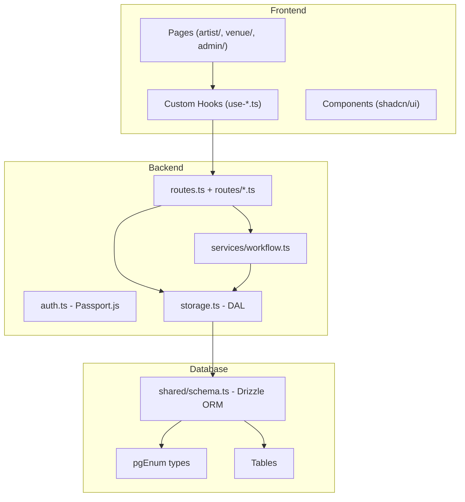
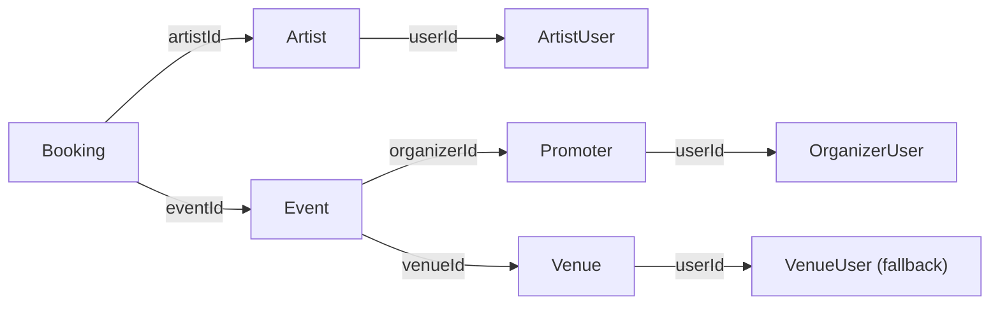
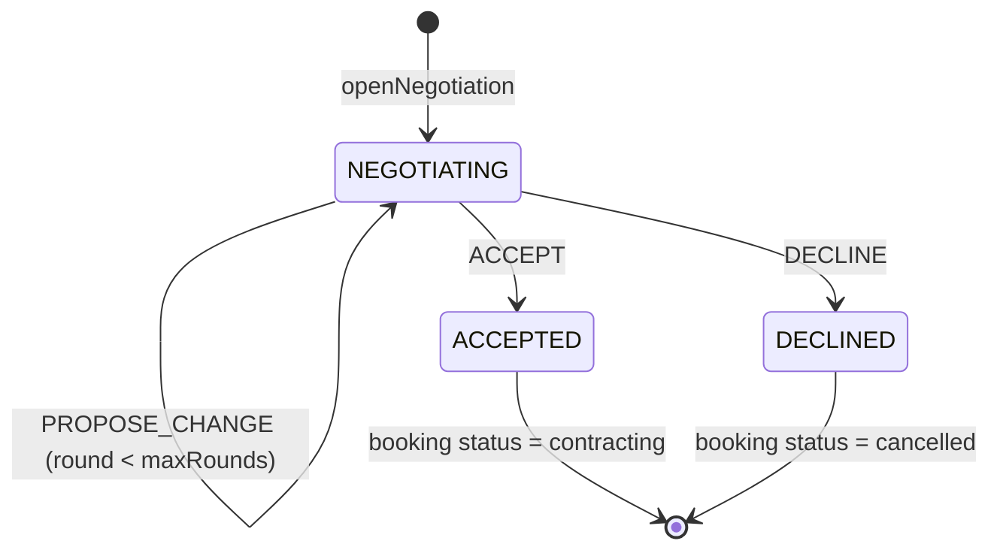
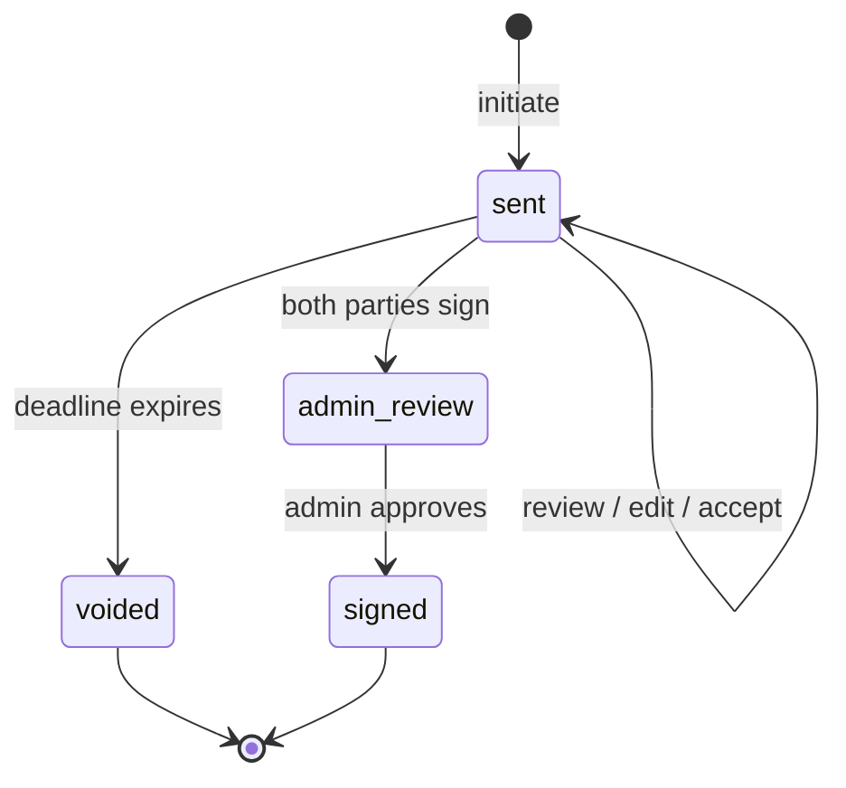

# Design Document: Platform Core Fixes

## Overview

This design addresses 12 interconnected requirements spanning role management, profile creation, negotiation workflows, and contract lifecycle in the music booking platform. The fixes target inconsistencies between frontend, backend, and database schema that prevent correct end-to-end operation.

The changes are primarily bug fixes and alignment corrections to existing code rather than new feature development. The architecture remains unchanged — we fix the existing Express routes, Drizzle ORM schema, storage layer, workflow service, and React frontend to work correctly together.

## Architecture

The platform follows a monolithic PERN architecture with clear layer separation:



### Key Fix Areas

1. **Auth Layer** (`server/auth.ts`): Role mapping during registration
2. **Profile Routes** (`server/routes.ts`): Artist and venue profile completion endpoints
3. **Conversation Routes** (`server/routes/conversations.ts`): Participant resolution
4. **Workflow Service** (`server/services/workflow.ts`): State machine fixes
5. **Contract Routes** (`server/routes/contracts.ts`): Full lifecycle corrections
6. **Schema** (`shared/schema.ts`): Enum consistency and migration
7. **Frontend** (`client/src/App.tsx`, hooks): Role resolution, venue status hook

## Components and Interfaces

### 1. Auth System — Registration and Role Mapping

**File**: `server/auth.ts` — `POST /api/register` handler

Current bug: Registering with role "venue" stores "venue" in metadata, but `role_name` enum and auth checks expect "venue_manager". Registering as "organizer" does not create a promoter record unless `roleData` is provided.

**Fix**:
- Map `role: "venue"` to store `metadata.role = "venue_manager"`
- When `role === "organizer"`, always call `storage.createOrganizer()` even without `roleData`
- Default to "artist" when no role specified

```typescript
// In POST /api/register handler
const normalizedRole = req.body.role === 'venue' ? 'venue_manager' : (req.body.role || 'artist');

const user = await storage.createUser({
  ...fields,
  metadata: { role: normalizedRole },
});

// Ensure organizer record for organizer role
if (normalizedRole === 'organizer') {
  const existingOrg = await storage.getOrganizerByUserId(user.id);
  if (!existingOrg) {
    await storage.createOrganizer({
      userId: user.id,
      name: req.body.name || user.displayName || 'Organizer',
      ...(req.body.roleData || {}),
    });
  }
}
```

### 2. Role Resolver

**Files**: `client/src/App.tsx` (`getUserRole`), `server/auth.ts` (deserializeUser), `server/routes/contracts.ts` (`getUserRole`)

Priority: `metadata.role` first, then profile entity fallback, then default "artist". Treat "venue" and "venue_manager" identically everywhere.

```typescript
function getUserRole(user: any): string {
  if (user.metadata?.role) {
    const role = user.metadata.role;
    return role === 'venue' ? 'venue_manager' : role;
  }
  if (user.venue) return 'venue_manager';
  if (user.organizer) return 'organizer';
  if (user.artist) return 'artist';
  return 'artist';
}
```

### 3. Profile Completion Endpoints

**File**: `server/routes.ts`

Both artist and venue endpoints follow the upsert pattern:
1. Validate input with Zod schema
2. Check for existing record by userId
3. Create or update with `metadata.profileComplete = true`
4. Return the created/updated record

Artist endpoint fix: The role check `user.role !== 'artist'` is correct but must also work when `metadata.role` is used.

Venue endpoint fix: Accept roles "venue_manager", "venue", and "organizer" — currently the role check is commented out / too loose. Add explicit check:

```typescript
const allowedRoles = ['venue_manager', 'venue', 'organizer'];
if (!allowedRoles.includes(user.role) && !allowedRoles.includes(user.metadata?.role)) {
  return res.status(403).json({ message: "Not authorized to complete venue profile" });
}
```

### 4. Conversation System — Participant Resolution

**File**: `server/routes/conversations.ts`

The conversation open endpoint resolves participants through the booking chain:



Fix: When event has no organizer, fall back to venue manager. Use `storage.getBookingWithDetails()` to get the full chain in one call, then extract user IDs. Deduplicate participant IDs before inserting.

```typescript
const booking = await storage.getBookingWithDetails(entityId);
if (!booking) return res.status(404).json({ message: "Booking not found" });
if (!booking.artistId) return res.status(400).json({ message: "Booking has no artist" });

const participantIds: number[] = [];

// Artist user
if (booking.artist?.userId) participantIds.push(booking.artist.userId);

// Organizer user (from event)
if (booking.organizer?.userId) {
  participantIds.push(booking.organizer.userId);
} else if (booking.venue?.userId) {
  // Fallback: venue manager
  participantIds.push(booking.venue.userId);
}

// Deduplicate
const uniqueParticipants = [...new Set(participantIds)];
```

### 5. Workflow Engine — Negotiation State Machine

**File**: `server/services/workflow.ts`



Key fixes in `handleAction`:
- Use `wfInstance.round` and `wfInstance.maxRounds` from table columns (not `context.rounds` / `context.maxRounds`)
- ACCEPT sets booking status to `"contracting"` (currently sets `"confirmed"`)
- PROPOSE_CHANGE updates `booking.offerAmount` when payload includes it
- Each action inserts message with `messageType: "action"`, `actionKey`, `payload`, and `round`
- Locked workflow rejects all actions

### 6. Contract Lifecycle

**File**: `server/routes/contracts.ts`



The contract lifecycle enforces per-party ordering: review then accept then sign. One edit per party. Pending edits block accept/sign. 48-hour deadline on all actions. Dual signature triggers admin_review.

Existing implementation is largely correct. Key fixes:
- Ensure `getUserRole` in contracts.ts handles "venue_manager" and "organizer" correctly (both map to "promoter" side)
- Deadline enforcement endpoint voids contracts AND cancels associated bookings
- System messages posted for all state transitions

### 7. Schema Enums and Migration

**File**: `shared/schema.ts`, new migration file

Both enums already include the required values in the Drizzle schema definition:
- `bookingStatusEnum` includes "contracting" ✓
- `contractStatusEnum` includes "admin_review" ✓

A SQL migration is needed to add these values to the live PostgreSQL enum types if the database was created before these values were added:

```sql
DO $$
BEGIN
  IF NOT EXISTS (SELECT 1 FROM pg_enum WHERE enumlabel = 'contracting'
    AND enumtypid = (SELECT oid FROM pg_type WHERE typname = 'booking_status')) THEN
    ALTER TYPE booking_status ADD VALUE 'contracting';
  END IF;
END$$;

DO $$
BEGIN
  IF NOT EXISTS (SELECT 1 FROM pg_enum WHERE enumlabel = 'admin_review'
    AND enumtypid = (SELECT oid FROM pg_type WHERE typname = 'contract_status')) THEN
    ALTER TYPE contract_status ADD VALUE 'admin_review';
  END IF;
END$$;
```

## Data Models

No schema changes needed — all tables and fields already exist in `shared/schema.ts`. The fixes are in application logic.

### Role Mapping

| Registration Role | Stored metadata.role | Profile Entity | Auth Group |
|---|---|---|---|
| artist | artist | artists | artist |
| organizer | organizer | promoters | promoter |
| venue | venue_manager | venues | venue_manager |
| (none) | artist | — | artist |

### Contract Terms Structure (JSONB in contractVersions.terms)

Locked fields (from negotiation, cannot be edited): `fee`, `totalFee`, `currency`, `eventDate`, `eventTime`, `slotType`, `venueName`, `artistName`, `organizerName`, `performanceDuration`, `platformCommission`

Editable categories: `financial`, `travel`, `accommodation`, `technical`, `hospitality`, `branding`, `contentRights`, `cancellation`

### Workflow Instance State

The `conversationWorkflowInstances` table tracks negotiation state:
- `currentNodeKey`: "NEGOTIATING", "ACCEPTED", "DECLINED"
- `awaitingUserId`: The user who must act next (null when terminal)
- `round`: Current negotiation round (0-based, incremented on PROPOSE_CHANGE)
- `maxRounds`: Maximum allowed rounds (default 3)
- `locked`: Boolean flag to freeze the workflow

### Contract Lifecycle Fields (on `contracts` table)

Per-party tracking:
- `artistReviewDoneAt` / `promoterReviewDoneAt`: Review completion timestamps
- `artistEditUsed` / `promoterEditUsed`: One-time edit flags
- `artistAcceptedAt` / `promoterAcceptedAt`: EULA acceptance timestamps
- `artistSignedAt` / `promoterSignedAt`: Signature timestamps
- `signedByArtist` / `signedByPromoter`: Boolean signature flags
- `deadlineAt`: 48-hour deadline from initiation
- `currentVersion`: Current contract version number

## Correctness Properties

*A property is a characteristic or behavior that should hold true across all valid executions of a system — essentially, a formal statement about what the system should do. Properties serve as the bridge between human-readable specifications and machine-verifiable correctness guarantees.*

### Property 1: Role registration mapping preserves consistency

*For any* user registration with a specified role, the stored `metadata.role` should be "venue_manager" when the input role is "venue", "organizer" when the input role is "organizer" (with a corresponding promoter record created), and "artist" when no role is specified. The stored role should always be a valid value in the `role_name` enum.

**Validates: Requirements 1.1, 1.2, 1.5**

### Property 2: Role resolver treats venue and venue_manager identically

*For any* user with `metadata.role` set to either "venue" or "venue_manager", the role resolver should return the same canonical role string ("venue_manager"), and all authorization checks should produce identical results for both values.

**Validates: Requirements 1.3, 1.4**

### Property 3: Artist profile completion round-trip

*For any* valid artist profile data submitted to `POST /api/artists/profile/complete`, the resulting artist record should have `metadata.profileComplete === true`, and a subsequent call to `GET /api/artists/profile/status` should return `{ isComplete: true }`.

**Validates: Requirements 2.2, 2.3**

### Property 4: Artist profile upsert idempotence

*For any* artist user, calling `POST /api/artists/profile/complete` multiple times should always result in exactly one artist record for that user, with the latest data applied.

**Validates: Requirements 2.6**

### Property 5: Invalid artist profile data returns field-level errors

*For any* artist profile data that violates the Zod schema (e.g., missing required fields, out-of-range values), the endpoint should return a 400 response containing specific field-level error messages.

**Validates: Requirements 2.5**

### Property 6: Venue profile completion round-trip

*For any* valid venue profile data submitted by a user with role "venue_manager", "venue", or "organizer", the resulting venue record should have `metadata.profileComplete === true`, and a subsequent call to `GET /api/venues/profile/status` should return `{ isComplete: true }`.

**Validates: Requirements 3.2, 3.3, 3.5**

### Property 7: Invalid venue profile data returns field-level errors

*For any* venue profile data that violates the Zod schema, the endpoint should return a 400 response containing specific field-level error messages.

**Validates: Requirements 3.6**

### Property 8: Conversation opening resolves correct participants

*For any* booking with an artist and an event with an organizer, opening a negotiation conversation should create a conversation with both the artist's userId and the organizer's userId as participants, with no duplicates.

**Validates: Requirements 4.1, 4.6**

### Property 9: Conversation opening is idempotent

*For any* booking, calling the conversation open endpoint multiple times with the same entity type, entity ID, and conversation type should return the same conversation without creating duplicates.

**Validates: Requirements 4.3**

### Property 10: New negotiation conversations have correct initial workflow state

*For any* newly created negotiation conversation, the associated workflow instance should have `currentNodeKey` set to an initial state, `round` set to 0, and `locked` set to false.

**Validates: Requirements 4.4**

### Property 11: Workflow turn-taking enforcement

*For any* workflow action submitted by a user who is NOT the `awaitingUserId`, the Workflow_Engine should reject the action with an error.

**Validates: Requirements 5.1**

### Property 12: PROPOSE_CHANGE increments round and swaps turn

*For any* PROPOSE_CHANGE action on a workflow where `round < maxRounds`, the round counter should increment by 1 and `awaitingUserId` should swap to the other participant.

**Validates: Requirements 5.2**

### Property 13: Max rounds enforcement

*For any* workflow where `round >= maxRounds`, a PROPOSE_CHANGE action should be rejected, while ACCEPT and DECLINE should still be allowed.

**Validates: Requirements 5.3**

### Property 14: Terminal negotiation actions update booking status correctly

*For any* ACCEPT action, the booking status should become "contracting". *For any* DECLINE action, the booking status should become "cancelled". Both should set `awaitingUserId` to null.

**Validates: Requirements 5.4, 5.5**

### Property 15: Workflow actions produce action messages

*For any* workflow action processed by the Workflow_Engine, a message with `messageType: "action"` should be inserted containing the `actionKey`, `payload`, and current `round`.

**Validates: Requirements 5.6**

### Property 16: Locked workflow rejects all actions

*For any* workflow instance where `locked === true`, all action submissions should be rejected regardless of the action type or user.

**Validates: Requirements 5.7**

### Property 17: PROPOSE_CHANGE with offerAmount updates booking

*For any* PROPOSE_CHANGE action that includes an `offerAmount` in the payload, the booking's `offerAmount` field should be updated to match the proposed amount.

**Validates: Requirements 5.8**

### Property 18: Messages returned in chronological order

*For any* conversation, the messages endpoint should return messages sorted by `createdAt` in ascending order (oldest first).

**Validates: Requirements 6.1**

### Property 19: Non-participants cannot access messages

*For any* user who is not a participant in a conversation, requesting messages for that conversation should return a 403 error.

**Validates: Requirements 6.2**

### Property 20: Negotiation conversations reject free-text messages

*For any* conversation with `conversationType === "negotiation"`, posting a free-text message should return a 400 error with the message "Free text not allowed in this mode. Use actions."

**Validates: Requirements 6.3**

### Property 21: System messages have null sender and system type

*For any* system event (negotiation accepted, declined, contract state change), the inserted message should have `senderId` set to null and `messageType` set to "system".

**Validates: Requirements 6.4**

### Property 22: Contract text contains core terms from booking

*For any* contract initiated from a booking, the generated contract text should contain the fee amount, event date, venue name, and artist name from the booking and event records.

**Validates: Requirements 7.2**

### Property 23: Contract initiation sets 48-hour deadline

*For any* newly initiated contract, the `deadlineAt` field should be exactly 48 hours after `initiatedAt`.

**Validates: Requirements 7.3**

### Property 24: Contract initiation creates version 1

*For any* newly initiated contract, a `contractVersions` record should exist with `version: 1`, containing the generated text and structured terms.

**Validates: Requirements 7.4**

### Property 25: Contract initiation is idempotent

*For any* booking that already has a contract, calling the initiate endpoint again should return the existing contract without creating a duplicate.

**Validates: Requirements 7.5**

### Property 26: One-time edit enforcement

*For any* party that has already used their edit (`artistEditUsed` or `promoterEditUsed` is true), a subsequent PROPOSE_EDITS review action should be rejected with a 400 error.

**Validates: Requirements 8.3**

### Property 27: Pending edits block accept and sign

*For any* contract with a pending edit request (status "pending"), accept and sign actions by either party should be rejected.

**Validates: Requirements 8.4, 9.7**

### Property 28: Edit approval creates new version with merged terms

*For any* approved edit request, a new contract version should be created with the changes deep-merged into the current terms, and the contract's `currentVersion` should increment.

**Validates: Requirements 8.5**

### Property 29: Edit rejection preserves current version

*For any* rejected edit request, the contract's `currentVersion` should remain unchanged and no new version record should be created.

**Validates: Requirements 8.6**

### Property 30: Locked fields cannot be modified

*For any* proposed contract changes that include any locked field (fee, totalFee, currency, eventDate, eventTime, slotType, venueName, artistName, organizerName, performanceDuration, platformCommission), the validation should reject the changes.

**Validates: Requirements 8.7**

### Property 31: Contract edit validation rules

*For any* proposed contract changes, payment milestone percentages must sum to 100%, cancellation penalties must be between 0-100%, and check-in time must be before check-out time. Violations should produce specific error messages.

**Validates: Requirements 8.8**

### Property 32: Contract lifecycle ordering enforcement

*For any* party attempting to accept a contract, the system should require that the party has completed their review first. *For any* party attempting to sign, the system should require that the party has accepted first.

**Validates: Requirements 9.1, 9.2**

### Property 33: Signature data completeness

*For any* contract signature, the record should contain the signature data, signature type (drawn/typed/uploaded), IP address, and user agent.

**Validates: Requirements 9.3**

### Property 34: Dual signature triggers admin_review and sets signedAt

*For any* contract where both parties have signed, the contract status should be set to "admin_review" and `signedAt` should be set to the current timestamp.

**Validates: Requirements 9.4, 9.5**

### Property 35: Expired deadline rejects all contract actions

*For any* contract whose `deadlineAt` is in the past, all review, accept, and sign actions should be rejected with a "deadline passed" error.

**Validates: Requirements 9.6**

### Property 36: Deadline enforcement voids contracts and cancels bookings

*For any* contract with status "sent" whose `deadlineAt` is in the past, the deadline check should set the contract status to "voided" and the associated booking status to "cancelled" with meta indicating "contract_deadline_expired".

**Validates: Requirements 10.1, 10.2**

### Property 37: Voided contracts reject further actions

*For any* contract with status "voided", all review, accept, sign, and edit actions should be rejected.

**Validates: Requirements 10.4**

## Error Handling

### Auth and Registration
- Missing role defaults to "artist" (not an error)
- Duplicate username returns 409
- Invalid registration data returns 400 with field errors

### Profile Completion
- Invalid Zod data returns 400 with `errors` array containing field-level messages
- Unauthorized role returns 403
- Server errors return 500

### Conversations
- Booking not found returns 404
- Booking has no artist returns 400
- Non-participant access returns 403
- Free text in negotiation returns 400

### Workflow Engine
- Not your turn returns 400 with awaiting user info
- Max rounds reached returns 400
- Workflow locked returns 400
- Invalid action returns 400

### Contract System
- Deadline passed returns 400 on all actions
- Contract voided returns 400 on all actions
- Pending edit blocks accept/sign with 400
- Edit already used returns 400
- Locked field changes return 400 with specific field names
- Validation failures return 400 with errors array

### General
- All 500 errors log to console with full error details
- Development mode includes error messages in response
- Production mode returns generic error messages

## Testing Strategy

### Testing Framework

- **Unit/Integration Tests**: Vitest (already in the Node.js/TypeScript ecosystem)
- **Property-Based Testing**: fast-check (TypeScript PBT library)
- **Test Runner**: `vitest --run` for single execution

### Unit Tests

Unit tests cover specific examples, edge cases, and error conditions:

- Registration with each role type and edge cases (missing role, "venue" mapping)
- Profile completion with valid/invalid data
- Conversation participant resolution with various booking configurations
- Workflow state transitions for each action type
- Contract lifecycle steps in sequence
- Validation functions (locked fields, milestone sums, penalty ranges, time ordering)
- Deadline enforcement with expired and non-expired contracts

### Property-Based Tests

Property tests verify universal properties across generated inputs. Each property test:
- Runs minimum 100 iterations
- References its design document property number
- Uses fast-check for input generation

Tag format: **Feature: platform-core-fixes, Property {number}: {property_text}**

Key property test areas:

1. **Role mapping** (Properties 1-2): Generate random role strings, verify normalization
2. **Profile upsert** (Properties 3-7): Generate valid/invalid profile data, verify round-trip and idempotence
3. **Workflow state machine** (Properties 11-17): Generate sequences of actions, verify state transitions
4. **Contract validation** (Properties 30-31): Generate random contract changes, verify locked field rejection and validation rules
5. **Contract lifecycle ordering** (Properties 32, 35, 37): Generate action sequences, verify ordering enforcement
6. **Deadline enforcement** (Property 36): Generate contracts with various deadline states, verify voiding behavior

### Test Organization

```
tests/
  server/
    auth.test.ts           — Registration role mapping, role resolver
    profile.test.ts        — Artist/venue profile completion
    conversations.test.ts  — Participant resolution, message ordering
    workflow.test.ts       — Negotiation state machine
    contracts.test.ts      — Contract lifecycle, validation
    deadline.test.ts       — Deadline enforcement
  properties/
    role-mapping.prop.ts   — Properties 1-2
    profile.prop.ts        — Properties 3-7
    workflow.prop.ts       — Properties 11-17
    contract-validation.prop.ts — Properties 30-31
    contract-lifecycle.prop.ts  — Properties 32-37
```
