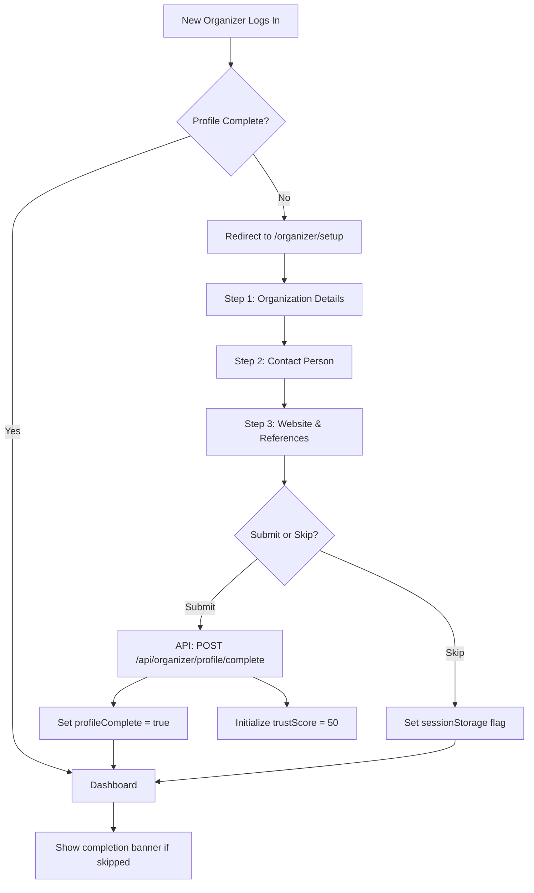

# Organizer Onboarding Documentation

## Overview

The Organizer Onboarding Wizard is a multi-step form that guides new organizers through completing their profile on the BANDWIDTH platform. This is a critical first-time user experience that collects essential information needed for organizers to start creating events and booking artists.

## Purpose

The onboarding wizard serves several key purposes:

1. **Profile Completion**: Collects required information to activate full platform access
2. **Trust Score Initialization**: Sets the initial trust score to 50 upon completion
3. **Credibility Building**: Gathers past event references and contact details to establish legitimacy
4. **User Experience**: Provides a guided, step-by-step process that reduces cognitive load

## User Flow



## Technical Architecture

### Component Structure

**File**: `client/src/pages/organizer/OrganizerSetup.tsx`

**Dependencies**:
- React Hook Form: Form state management and validation
- Zod: Schema validation via `organizerOnboardingSchema`
- Wouter: Client-side routing
- TanStack Query: Server state management via `useCompleteOnboarding` hook
- shadcn/ui: UI components (Card, Input, Button, etc.)

### State Management

The component manages three types of state:

1. **Form State** (React Hook Form):
   - `organizationName`: string
   - `description`: string
   - `contactPerson`: { name, email, phone }
   - `website`: string (optional)
   - `pastEventReferences`: string[] (optional)

2. **UI State** (React useState):
   - `currentStep`: number (1-3)
   - Progress indicator value

3. **Server State** (TanStack Query):
   - Mutation status (pending, success, error)
   - Handled by `useCompleteOnboarding` hook

### Validation Strategy

**Client-Side Validation**:
- Step-by-step validation using `form.trigger()`
- Only validates fields relevant to current step
- Prevents progression until current step is valid

**Server-Side Validation**:
- Final validation via `organizerOnboardingSchema` on API endpoint
- Ensures data integrity even if client validation is bypassed

## Step-by-Step Breakdown

### Step 1: Organization Details

**Fields**:
- Organization Name (required, 2-200 chars)
- Description (required, 10-2000 chars)

**Purpose**: Establishes the organizer's brand identity and provides context about their business.

**Validation**:
```typescript
organizationName: z.string().min(2).max(200)
description: z.string().min(10).max(2000)
```

**User Guidance**:
- Placeholder text provides examples
- Character count guidance shown below description field
- Real-time error messages on validation failure

### Step 2: Contact Person

**Fields**:
- Contact Person Name (required, min 2 chars)
- Contact Email (required, valid email format)
- Contact Phone (required, min 10 chars)

**Purpose**: Collects primary contact details for booking coordination and platform communication.

**Validation**:
```typescript
contactPerson: {
  name: z.string().min(2),
  email: z.string().email(),
  phone: z.string().min(10)
}
```

**User Guidance**:
- Phone field includes country code hint (+91 for India)
- Email validation provides immediate feedback
- All fields required to proceed

### Step 3: Website & References

**Fields**:
- Website URL (optional, must be valid URL)
- Past Event References (optional, array of strings)

**Purpose**: Builds credibility by linking to existing online presence and past work.

**Validation**:
```typescript
website: z.string().url().optional()
pastEventReferences: z.array(z.string().min(1)).optional()
```

**User Guidance**:
- Multi-line textarea for past events (one per line)
- Examples provided in placeholder text
- Both fields optional to reduce friction

## Data Flow

### Form Submission

```typescript
// 1. User clicks "Complete Setup"
onSubmit(data) {
  // 2. Filter empty references
  const payload = {
    ...data,
    pastEventReferences: data.pastEventReferences?.filter(ref => ref.trim() !== "")
  };
  
  // 3. Trigger mutation
  completeMutation.mutate(payload, {
    onSuccess: () => {
      // 4. Redirect to dashboard
      setLocation("/dashboard");
    }
  });
}
```

### API Request

**Endpoint**: `POST /api/organizer/profile/complete`

**Request Body**:
```json
{
  "organizationName": "Sunrise Events",
  "description": "Bangalore-based event management company...",
  "contactPerson": {
    "name": "Rahul Kumar",
    "email": "rahul@sunrise.events",
    "phone": "+919876543210"
  },
  "website": "https://sunrise.events",
  "pastEventReferences": [
    "https://instagram.com/p/sunrisefest2025",
    "Organized Techno Night at Blue Frog, March 2025"
  ]
}
```

### Database Storage

**Table**: `promoters`

**Columns Updated**:
- `name` ← organizationName
- `description` ← description
- `contact_person` (JSONB) ← contactPerson object
- `metadata` (JSONB) ← Extended fields:
  ```json
  {
    "profileComplete": true,
    "trustScore": 50,
    "website": "https://sunrise.events",
    "pastEventReferences": ["..."]
  }
  ```
- `updated_at` ← Current timestamp

## Skip Functionality

### Purpose

Allows users to defer profile completion without blocking platform access. This reduces friction for users who want to explore the platform before committing to full onboarding.

### Implementation

```typescript
const handleSkip = () => {
  // Set flag in sessionStorage (persists for session only)
  sessionStorage.setItem("organizer_onboarding_skipped", "true");
  
  // Redirect to dashboard
  setLocation("/dashboard");
};
```

### Consequences

- User can access dashboard and explore features
- Persistent banner shown on dashboard prompting completion
- Profile status remains `isComplete: false`
- Some features may be restricted until profile is complete

### Re-prompting Logic

The dashboard checks profile status and displays a banner:

```typescript
const { data: profileStatus } = useOrganizerProfileStatus();

{!profileStatus?.isComplete && (
  <Alert>
    <AlertTitle>Complete Your Profile</AlertTitle>
    <AlertDescription>
      Finish setting up your organizer profile to unlock all features.
    </AlertDescription>
  </Alert>
)}
```

## UI/UX Design Patterns

### Progressive Disclosure

The wizard uses a step-by-step approach to avoid overwhelming users:
- Only shows fields relevant to current step
- Progress bar provides visual feedback
- Step indicator shows current position (e.g., "Step 2 of 3")

### Validation Feedback

**Real-time validation**:
- Errors shown immediately after field blur
- Error messages positioned below each field
- Red text color for high visibility

**Step validation**:
- "Next" button triggers validation for current step only
- Prevents progression until step is valid
- Smooth transition between steps on success

### Visual Design

**Background Effects**:
- Blurred gradient orbs create depth
- Glassmorphism card effect (semi-transparent with backdrop blur)
- Subtle animations on step transitions

**Accessibility**:
- Proper label associations (`htmlFor` attributes)
- Semantic HTML structure
- Keyboard navigation support
- Screen reader friendly error messages

## Error Handling

### Client-Side Errors

**Validation Errors**:
```typescript
{form.formState.errors.organizationName && (
  <p className="text-xs text-destructive">
    {form.formState.errors.organizationName.message}
  </p>
)}
```

**Network Errors**:
Handled by `useCompleteOnboarding` hook:
```typescript
onError: (error: Error) => {
  toast({
    title: "Onboarding Failed",
    description: error.message,
    variant: "destructive"
  });
}
```

### Server-Side Errors

**400 Bad Request**: Validation failure
- Returns field-specific error messages
- Client displays errors inline

**401 Unauthorized**: Session expired
- Redirects to login page
- Preserves form data in sessionStorage (future enhancement)

**500 Internal Server Error**: Unexpected failure
- Generic error message shown
- User can retry submission

## Testing Strategy

### Unit Tests

Test individual functions and validation logic:

```typescript
describe('OrganizerSetup', () => {
  it('validates organization name length', () => {
    const result = organizerOnboardingSchema.safeParse({
      organizationName: "A", // Too short
      // ... other fields
    });
    expect(result.success).toBe(false);
  });
});
```

### Integration Tests

Test form submission flow:

```typescript
it('completes onboarding and redirects to dashboard', async () => {
  render(<OrganizerSetup />);
  
  // Fill step 1
  fireEvent.change(screen.getByLabelText('Organization Name'), {
    target: { value: 'Sunrise Events' }
  });
  // ... fill other fields
  
  // Submit
  fireEvent.click(screen.getByText('Complete Setup'));
  
  // Assert redirect
  await waitFor(() => {
    expect(mockSetLocation).toHaveBeenCalledWith('/dashboard');
  });
});
```

### Property-Based Tests

Test universal correctness properties:

**Property 4: Onboarding round-trip**
- For any valid input, stored data matches submitted data
- Implemented in `tests/properties/organizer-routes.prop.test.ts`

**Property 5: Trust score initialization**
- Trust score is always exactly 50 after completion
- Implemented in `tests/properties/organizer-routes.prop.test.ts`

## Performance Considerations

### Form State Optimization

- React Hook Form minimizes re-renders
- Only validates fields when necessary (on blur, on submit)
- Debounced validation for expensive checks (future enhancement)

### Bundle Size

- Lazy load component (not on initial page load)
- Tree-shaking removes unused Zod validators
- shadcn/ui components are modular

### Network Optimization

- Single API call on final submission (not per-step)
- Optimistic UI updates on success
- Retry logic for failed requests (via TanStack Query)

## Security Considerations

### Input Sanitization

- Zod schema validates all inputs before submission
- Server-side validation prevents malicious payloads
- SQL injection prevented by Drizzle ORM parameterized queries

### Session Management

- Requires authenticated session to access
- Session cookie is httpOnly and secure
- CSRF protection via session-based auth

### Data Privacy

- Contact information stored securely in database
- No sensitive data in client-side storage (except skip flag)
- HTTPS enforced in production

## Future Enhancements

### Planned Features

1. **Auto-save Draft**: Persist form data to localStorage
2. **Email Verification**: Send verification email to contact email
3. **Social Media Integration**: Auto-fetch profile data from Instagram/LinkedIn
4. **Image Upload**: Add logo/banner image upload
5. **Multi-language Support**: Internationalization for non-English users

### Technical Debt

1. **Accessibility Audit**: Full WCAG 2.1 AA compliance check
2. **Mobile Optimization**: Improve touch targets and keyboard behavior
3. **Analytics**: Track drop-off rates per step
4. **A/B Testing**: Test different field orders and copy

## Troubleshooting

### Common Issues

**Issue**: Form doesn't progress to next step
- **Cause**: Validation errors on current step
- **Solution**: Check error messages below fields, fix invalid inputs

**Issue**: "Complete Setup" button disabled
- **Cause**: Mutation is pending (API request in progress)
- **Solution**: Wait for request to complete, check network tab for errors

**Issue**: Redirect to /organizer/setup after skipping
- **Cause**: sessionStorage flag cleared (new session)
- **Solution**: Complete onboarding or skip again

**Issue**: 401 Unauthorized error
- **Cause**: Session expired
- **Solution**: Log in again, form data will be lost (future: auto-save)

## Related Documentation

- [Organizer API Documentation](./ORGANIZER_API.md) - API endpoint details
- [Validation Schemas](./VALIDATION_SCHEMAS.md) - Schema reference
- [Code Architecture](./CODE_ARCHITECTURE.md) - Architectural patterns
- [Requirements Document](../.kiro/specs/organizer-role/requirements.md) - Business requirements
- [Design Document](../.kiro/specs/organizer-role/design.md) - Technical design

## Support

For issues or questions:
- Check the [troubleshooting section](#troubleshooting) above
- Review the [requirements document](../.kiro/specs/organizer-role/requirements.md)
- Contact the development team via internal Slack channel
